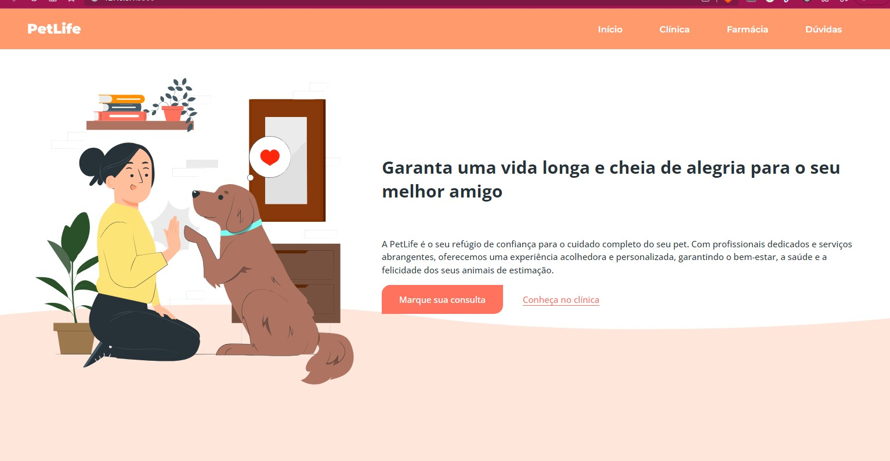

# PetLife

Um website para um Petshop, construído com o Minicurso da plataforma 

Este é o repositório oficial do minicurso de Desenvolvimento Web da plataforma [onebitcode](https://www.onebitcode.com/), focado em iniciantes. Durante o curso, você aprenderá os conceitos básicos de HTML, CSS e JavaScript, enquanto trabalha no projeto inicial de um website para a PetLife. 

## Descrição do Curso

O objetivo deste minicurso é proporcionar a você as habilidades fundamentais para criar e estilizar páginas web e adicionar interatividade com JavaScript. O projeto da PetLife servirá como um exemplo prático para aplicar o que você aprendeu. 

